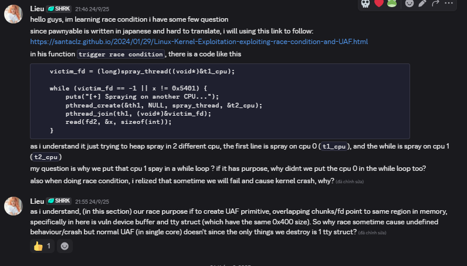

### Ref

you should read [original series's post](https://pawnyable.cafe/linux-kernel/LK01/race_condition.html) to better understand what is race condition, use [wohin's post](https://blog.wohin.me/posts/pawnyable-0204/) and [santaclz's post](https://santaclz.github.io/2024/01/29/Linux-Kernel-Exploitation-exploiting-race-condition-and-UAF.html) for guideline...

### Thought

still no one answer my 2 questions yet (will update):

i update the spraying function: also put the spraying on cpu 0 in a while loop

my exploit use 1 uaf only, since i put the rop chain at the end of tty struct to save memory, so no need to trigger more uaf or race -> more stable

also i testing a new template for modprobe path exploit, merging the exploit and evilsu to one, using argc passed to exploit to classify them...